---
theme:
  name: catppuccin-macchiato
title: Async Rust on bare metal with Embassy
author: Prabhpreet Dua
options:
  end_slide_shorthand: true
---

Hello hardware: Let us build a contrived embedded system
===

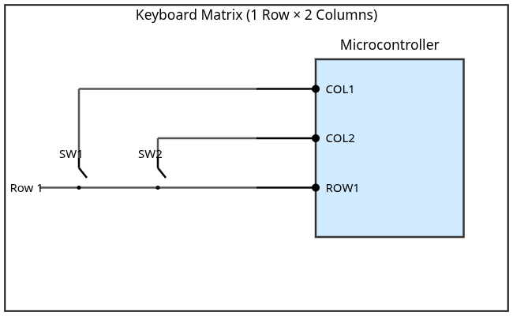

How it should work:
- Column voltages alternately toggle every 100 ms

- Row is read if column is connected

 Let's build some (horrible) firmware

----
Embedded Systems: The Brains 
===

Microcontrollers: processor(s) + peripherals 

# ESP32C3

~ 408K SRAM, 4MB on-board flash

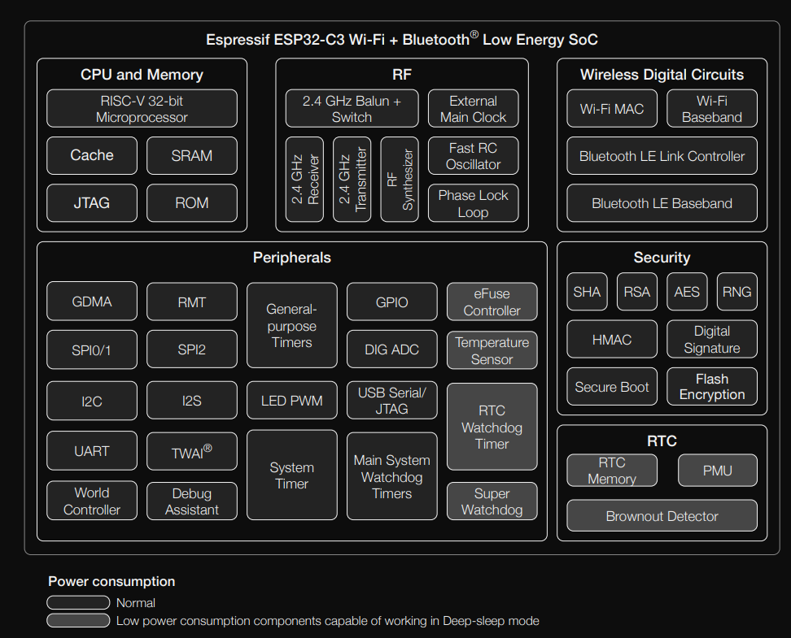

------
Concurrency on embedded systems
===

Patterns:
- Superloop: KISS- implement state machine
- Superloop(ish) with interrupts
<!-- pause -->
- Real time operating systems:
	- Task, scheduling algorithms, context switches
		- FreeRTOS
		- RT Linux
		- VxWorks
<!-- pause -->
- async/await: A new paradigm?

|                 | Superloop      | RTOS                | async/await         |
| --------------- | -------------- | ------------------- | ------------------- |
| Blocking OK?    | *No*           | Yes                 | *No*                |
| Scheduling      | *Cooperative*  | Preemptive          | *Cooperative*       |
| User Interface  | State Machines | *Normal/Procedural* | *Normal/Procedural* |
| Stack           | *One*          | One per task        | *One*               |
| Event Loop (UX) | One            | *One per task*      | *One per task*      |


-----
Embassy
===

> "An executor **AND** a Hardware Access Layer (HAL)" framework

# Executor
- No alloc, no heap needed.
- Statically allocated tasks
- No busy-loop polling: CPU sleeps using interrupts or WFE/SEV.
- Efficient polling: a wake will only poll the woken task, not all of them.
- Fair task scheduling
# HAL
- Batteries Included: Networking, Bluetooth, USB ...
- `esp-embassy-hal`: Has it's own executor wrapper, timer driver

----
KB Implementation in Embassy
===

```bash +exec
bash goto.sh async-impl-v1 asynckb-esp/src/bin/main.rs 1
```

# Three tasks
## main
- Initializes, stores input/output "drivers" in static memory
- Spawns other 2 tasks
- Receives PrintEvent to print output (think communication process)
<!-- pause -->
## process_input_task

- Asynchronously waits for an input edge trigger
- Detects if high/low to track if button is pressed, and current column through atomic load
- Sends PrintEvent through Channel

<!-- pause -->
## output_toggle_task

- Waits for matrix poll time: 100ms
- Toggles output 
- Stores current pin index in atomic


<!-- pause -->

# Demo

-----
KB Implementation in Embassy
===
# Emulation, tracing
```bash +exec
bash goto.sh async-impl-v1 asynckb-spin/src/main.rs 1
```
- On `arch-spin` target emulation
- Perfetto traces using tracing-subscriber: ui.perfetto.dev

-----
KB Implementation in Embassy
===
# Macros Expanded

```bash +exec
bash goto.sh async-impl-v1m asynckb-spin/src/main.rs 1
```
## Wrapper
- Original main and task functions are renamed
- Wrapped with `fn(args) -> SpawnToken<impl Sized>` 
<!-- pause -->
## Entrypoint

Main function creates an executor, transmutes its lifetime to static and executes `run` method on it 


----
Walkthrough with memory view
===
# Entrypoint
```bash +exec
bash goto.sh async-impl-v1m asynckb-spin/src/main.rs 68
```

----
Walkthrough with memory view
===
# Entrypoint
<!-- column_layout: [1, 1] -->
<!--column: 0 -->
- Executor created on stack
```d2 +render

classes: {
  struct: {
    shape: rectangle
    grid-columns: 1
    grid-gap: 4
  }
  struct-static: {
    shape: rectangle
    grid-columns: 1
    grid-gap: 4
    style: {
		fill: green
	}
  }
  uninit : {
	  style: {
		stroke: grey
		fill: grey
	}
  }
}

stack: {
  class: struct
  Executor: {
    class: struct
	  SyncExecutor {
	    class: struct
		  RunQueue.class: uninit
		  Pender
	  }
  }
}
```

<!--column: 1 -->
<!-- pause -->
Observations:
- Executor created, and transmutes lifetime to static
- SpinExecutor and raw::Executor are non-send, non-sync, despite holding SyncExecutor

----
Walkthrough with memory view
===
# Executor runs
<!-- column_layout: [1, 1] -->
<!--column: 0 -->
- Executor gets a spawner

```d2 +render 

classes: {
  struct: {
    shape: rectangle
    grid-columns: 1
    grid-gap: 4
  }
  struct-static: {
    shape: rectangle
    grid-columns: 1
    grid-gap: 4
    style: {
		fill: green
	}
  }
  uninit : {
	  style: {
		stroke: grey
		fill: grey
	}
  }
}

stack: {
  class: struct
  Executor: {
    class: struct
    style: {
		stroke: green
	}
	  SyncExecutor {
	    class: struct
		  RunQueue.class: uninit
		  Pender
	  }
  }
  Spawner: {
	  class: struct
	  executor: {
	      class: struct
	      label: "&'static Executor"
		  style: {
			stroke: green
		  }
	  }
  }
}

stack.Spawner.executor --> stack.Executor : {
	style: {
		stroke: green
	}
}
```

<!--column: 1 -->
<!-- pause -->
Observations:
-  Spawner is not-send, and copy

----
Walkthrough with memory view
===
# Executor runs
- Executor runs the init closure:  `FnOnce(Spawner)`
<!-- pause -->
-  Generate spawn token: 
	 `fn task_spawner(args) -> SpawnToken<impl Sized>`
<!-- pause -->
<!-- column_layout: [1, 1] -->
<!--column: 0 -->
```d2 +render

classes: {
  struct: {
    shape: rectangle
    grid-columns: 1
    grid-gap: 4
  }
  struct-static: {
    shape: rectangle
    grid-columns: 1
    grid-gap: 4
    style: {
		fill: green
	}
  }
  uninit : {
	  style: {
		stroke: grey
		fill: grey
	}
  }
}

stack: {
  class: struct
  Executor: {
    class: struct
    style: {
		stroke: green
	}
	  SyncExecutor {
	    class: struct
		  RunQueue.class: uninit
		  Pender
	  }
  }
  Spawner: {
	  class: struct
	  executor: {
	      class: struct
	      label: "&'static Executor"
		  style: {
			stroke: green
		  }
	  }
  }
  
  SpawnerArg: "Spawner" {
	  class: struct
	  executor: {
	      class: struct
	      label: "&'static Executor"
		  style: {
			stroke: green
		  }
	  }
  }
}

stack.Spawner.executor --> stack.Executor : {
	style: {
		stroke: green
	}
}

stack.SpawnerArg.executor --> stack.Executor : {
	style: {
		stroke: green
	}
}
```

<!--column: 1 -->
Observations: Copy the spawner in the task spawner

----
Walkthrough with memory view
===
# Executor runs: Generating Spawn Token
- New TaskPool 
<!-- column_layout: [2, 1] -->
<!--column: 0 -->
```d2 +render

classes: {
  struct: {
    shape: rectangle
    grid-columns: 1
    grid-gap: 4
  }
  struct-static: {
    shape: rectangle
    grid-columns: 1
    grid-gap: 4
    style: {
		fill: green
	}
  }
  arr: {
	shape: rectangle
	grid-columns: 1
    grid-rows: 1
    grid-gap: 2
  }
  uninit : {
	  style: {
		stroke: grey
		fill: grey
	}
  }
}

stack: {
  class: struct
  Executor: {
    class: struct
    style: {
		stroke: green
	}
	  SyncExecutor {
	    class: struct
		  RunQueue.class: uninit
		  Pender
	  }
  }
  Spawner: {
	  class: struct
	  executor: {
	      class: struct
	      label: "&'static Executor"
		  style: {
			stroke: green
		  }
	  }
  }
  SpawnerArg: "Spawner" {
	  class: struct
	  executor: {
	      class: struct
	      label: "&'static Executor"
		  style: {
			stroke: green
		  }
	  }
  }
}

stack.Spawner.executor --> stack.Executor : {
	style: {
		stroke: green
	}
}

stack.SpawnerArg.executor --> stack.Executor : {
	style: {
		stroke: green
	}
}

static: {
    grid-rows: 1
	MainTaskPool: "Main TaskPool" {
		class: arr
		TaskStorage0: "TaskStorage[0]" {
			class: struct
			State: "State []" 
			Executor.class: uninit
			RunQueueItem.class: uninit
			poll_fn.class: uninit
			future.class: uninit
		}
    }
	PITaskPool: "Process Input TaskPool" {
		class: arr
		TaskStorage0: "TaskStorage[0]" {
			class: struct
			State: "State []" 
			Executor.class: uninit
			RunQueueItem.class: uninit
			poll_fn.class: uninit
			future.class: uninit
		}
    } 
	OPTaskPool: "Output Pin Toggle TaskPool" {
		class: arr
		TaskStorage0: "TaskStorage[0]" {
			class: struct
			State: "State []" 
			Executor.class: uninit
			RunQueueItem.class: uninit
			poll_fn.class: uninit
			future.class: uninit
		}
    }
	
}
```

<!-- pause -->
<!--column: 1 -->
Observations:
- Static initialization of TaskPool (bss)
- TaskPoolHolder holds data size of pool with alignment, transmute from TaskPool

----
Walkthrough with memory view
===
# Executor runs: Generating Spawn Token
- Spawn async fn

<!-- pause -->
<!-- column_layout: [3, 1] -->
<!--column: 0 -->
```d2 +render

classes: {
  struct: {
    shape: rectangle
    grid-columns: 1
    grid-gap: 4
  }
  struct-static: {
    shape: rectangle
    grid-columns: 1
    grid-gap: 4
    style: {
		fill: green
	}
  }
  arr: {
	shape: rectangle
	grid-columns: 1
    grid-rows: 1
    grid-gap: 2
  }
  uninit : {
	  style: {
		stroke: grey
		fill: grey
	}
  }
}

stack: {
  class: struct
  Executor: {
    class: struct
    style: {
		stroke: green
	}
	  SyncExecutor {
	    class: struct
		  RunQueue.class: uninit
		  Pender
	  }
  }
  Spawner: {
	  class: struct
	  executor: {
	      class: struct
	      label: "&'static Executor"
		  style: {
			stroke: green
		  }
	  }
  }
  SpawnToken: {
	  class: struct
	  OptTaskRef: "Option<TaskRef>"
  }
}

stack.Spawner.executor --> stack.Executor : {
	style: {
		stroke: green
	}
}

static: {
    grid-rows: 1
	MainTaskPool: "Main TaskPool" {
		class: arr
		TaskStorage0: "TaskStorage[0]" {
			style: {
			  stroke: red
			}
			class: struct
			State: "State [SPAWNED, QUEUED]" 
			Executor.class: uninit
			RunQueueItem.class: uninit
			poll_fn
			future: {
				Spawner: {
				  class: struct
			      executor: "&'static Executor"
				}
			}
		}
	    
    }
	PITaskPool: "Process Input TaskPool" {
		class: arr
		TaskStorage0: "TaskStorage[0]" {
			class: struct
			State: "State []" 
			Executor.class: uninit
			RunQueueItem.class: uninit
			poll_fn.class: uninit
			future.class: uninit
		}
    } 
	OPTaskPool: "Output Pin Toggle TaskPool" {
		class: arr
		TaskStorage0: "TaskStorage[0]" {
			class: struct
			State: "State []" 
			Executor.class: uninit
			RunQueueItem.class: uninit
			poll_fn.class: uninit
			future.class: uninit
		}
    }
}
static.MainTaskPool.TaskStorage0.future.Spawner.executor -> stack.Executor.SyncExecutor : {
	style: {
		stroke: green
	}
}

stack.SpawnToken.OptTaskRef -> static.MainTaskPool.TaskStorage0: {
	style: {
		stroke: red
	}
}
```

<!-- pause -->
<!--column: 1 -->
Observations:
- Task init state initialized
	- Moved Spawner copy and generated future
	- Reserved task storage in task pool
	- Generated a spawn token
- Spawn Token generic monomorphised on Future Type

----
Walkthrough with memory view
===
# Executor runs: Must Spawn
- `spawner.must_spawn<S>(token: SpawnToken<S>)`
- Consumes spawn token
<!-- pause -->

```d2 +render

classes: {
  struct: {
    shape: rectangle
    grid-columns: 1
    grid-gap: 4
  }
  struct-static: {
    shape: rectangle
    grid-columns: 1
    grid-gap: 4
    style: {
		fill: green
	}
  }
  arr: {
	shape: rectangle
	grid-columns: 1
    grid-rows: 1
    grid-gap: 2
  }
  uninit : {
	  style: {
		stroke: grey
		fill: grey
	}
  }
}

stack: {
  class: struct
  Executor: {
    class: struct
    style: {
		stroke: green
	}
	  SyncExecutor {
	    class: struct
		  RunQueue
		  Pender
	  }
  }
}

static: {
    grid-rows: 1
	MainTaskPool: "Main TaskPool" {
		class: arr
		TaskStorage0: "TaskStorage[0]" {
			class: struct
			style: {
				stroke: red
			}
			State: "State [SPAWNED, QUEUED]" 
			Executor: {
				style: {
					stroke: green
				}
			}
			RunQueueItem.class: uninit
			poll_fn
			future: {
				Spawner: {
				  class: struct
			      executor: "&'static Executor"
				}
			}
		}
    }
	PITaskPool: "Process Input TaskPool" {
		class: arr
		TaskStorage0: "TaskStorage[0]" {
			class: struct
			State: "State []" 
			Executor.class: uninit
			RunQueueItem.class: uninit
			poll_fn.class: uninit
			future.class: uninit
		}
    } 
	OPTaskPool: "Output Pin Toggle TaskPool" {
		class: arr
		TaskStorage0: "TaskStorage[0]" {
			class: struct
			State: "State []" 
			Executor.class: uninit
			RunQueueItem.class: uninit
			poll_fn.class: uninit
			future.class: uninit
		}
    }
	
}

static.MainTaskPool.TaskStorage0.Executor -> stack.Executor.SyncExecutor : {
	style: {
		stroke: green
	}
}

static.MainTaskPool.TaskStorage0.future.Spawner.executor -> stack.Executor.SyncExecutor : {
	style: {
		stroke: green
	}
}

stack.Executor.SyncExecutor.RunQueue -> static.MainTaskPool.TaskStorage0 : {
	style: {
		stroke: red
	}
}

```

Observations:
- Spawn token consumed without drop
- Task enqueued with executor runqueue, and pender "pended"
- Fails on a bad spawn token

----
Walkthrough with memory view
===
# Executor runs: finally!
- Polling starts
<!-- pause -->
<!-- column_layout: [3, 1] -->
<!--column: 0 -->
- Run queue dequeues every task
```d2 +render

classes: {
  struct: {
    shape: rectangle
    grid-columns: 1
    grid-gap: 4
  }
  struct-static: {
    shape: rectangle
    grid-columns: 1
    grid-gap: 4
    style: {
		fill: green
	}
  }
  arr: {
	shape: rectangle
	grid-columns: 1
    grid-rows: 1
    grid-gap: 2
  }
  uninit : {
	  style: {
		stroke: grey
		fill: grey
	}
  }
}

stack: {
  class: struct
  Executor: {
    class: struct
    style: {
		stroke: green
	}
	  SyncExecutor {
	    class: struct
		  RunQueue.class : uninit
		  Pender
	  }
  }
}

static: {
    grid-rows: 1
	MainTaskPool: "Main TaskPool" {
		class: arr
		TaskStorage0: "TaskStorage[0]" {
			class: struct
			style: {
				stroke: red
			}
			State: "State [SPAWNED]" 
			Executor: {
				style: {
					stroke: green
				}
			}
			RunQueueItem.class: uninit
			poll_fn
			future: {
				Spawner: {
				  class: struct
			      executor: "&'static Executor"
				}
			}
		}
    }
	PITaskPool: "Process Input TaskPool" {
		class: arr
		TaskStorage0: "TaskStorage[0]" {
			class: struct
			State: "State []" 
			Executor.class: uninit
			RunQueueItem.class: uninit
			poll_fn.class: uninit
			future.class: uninit
		}
    } 
	OPTaskPool: "Output Pin Toggle TaskPool" {
		class: arr
		TaskStorage0: "TaskStorage[0]" {
			class: struct
			State: "State []" 
			Executor.class: uninit
			RunQueueItem.class: uninit
			poll_fn.class: uninit
			future.class: uninit
		}
    }
	
}

static.MainTaskPool.TaskStorage0.future.Spawner.executor -> stack.Executor.SyncExecutor : {
	style: {
		stroke: green
	}
}

static.MainTaskPool.TaskStorage0.Executor -> stack.Executor.SyncExecutor : {
	style: {
		stroke: green
	}
}

```

<!-- pause -->
<!--column: 1 -->
Observations:
-  TaskStorage state cleared the QUEUED flag

-----
Walkthrough with memory view
===
# Executor runs: finally!
- Polling starts
- Run queue dequeues every task
- Polling main task future

Poll function:
```bash +exec
bash goto.sh async-impl-v1m embassy/embassy-executor/src/raw/mod.rs 230 
```

----
Mask off: A recap of Future
===
<!-- column_layout: [3, 1] -->
<!--column: 0 -->
```rust
pub trait Future {
  type Output;
  
  fn poll(self: Pin<&mut Self>, cx: &mut Context<'_>) -> Poll<Self::Output>;
}

pub enum Poll<T> {
  Ready(T),
  Pending,
}

pub struct Context<'a> { /* private fields */ }
impl<'a> Context { 
  pub const fn waker(&self) -> &'a Waker; 
}

pub struct Waker { /* private fields */ }
impl Waker { 
	pub fn wake(self);
}
```
<!--column: 1 -->
# Running futures

## Executor
Poll the futures, but don't poll pending ones, unless they are woken up through a Waker

## Reactor
Invoke wakers

----
A recap of Future
----
# Waking mechanism
```rust
pub const unsafe fn Waker::new(
	data: *const (), 
	vtable: &'static RawWakerVTable) -> Waker;

/// A virtual function pointer table (vtable) that specifies the behavior of a RawWaker.
/// The pointer passed to all functions inside the vtable is the data pointer from the enclosing RawWaker object.

pub const fn RawWakerVTable::new(
    clone: unsafe fn(*const ()) -> RawWaker,
    wake: unsafe fn(*const ()),
    wake_by_ref: unsafe fn(*const ()),
    drop: unsafe fn(*const ()),
) -> RawWakerVTable
```

<!-- pause -->
# Embassy Waker

Just a `TaskRef`

```bash +exec
bash goto.sh async-impl-v1m embassy/embassy-executor/src/raw/waker.rs 1
```

<!-- pause -->
# Observations
On wake, the waker does two things:
- Sets back QUEUED state for the task
- Enqueues task by swapping executor RunQueue with its TaskRef and setting its RunQueueItem as the swapped TaskRef

----
Walkthrough with memory view
===
# Executor runs: finally!
- Polling starts
- Run queue dequeues every task
- Polling main task future- init, spawn two other tasks 

```bash +exec
bash goto.sh async-impl-v1m asynckb-spin/src/main.rs 24 
```

<!-- pause -->
<!-- column_layout: [3, 1] -->
<!--column: 0 -->
```d2 +render

classes: {
  struct: {
    shape: rectangle
    grid-columns: 1
    grid-gap: 4
  }
  struct-static: {
    shape: rectangle
    grid-columns: 1
    grid-gap: 4
    style: {
		fill: green
	}
  }
  arr: {
	shape: rectangle
	grid-columns: 1
    grid-rows: 1
    grid-gap: 2
  }
  uninit : {
	  style: {
		stroke: grey
		fill: grey
	}
  }
}

stack: {
  class: struct
  Executor: {
    class: struct
    style: {
		stroke: green
	}
	  SyncExecutor {
	    class: struct
		  RunQueue.class : uninit
		  Pender
	  }
  }
}

static: {
    grid-rows: 1
	MainTaskPool: "Main TaskPool" {
		class: arr
		TaskStorage0: "TaskStorage[0]" {
			class: struct
			State: "State [SPAWNED]" 
			Executor: {
				style: {
					stroke: green
				}
			}
			RunQueueItem.class: uninit
			poll_fn
			future: {
				Spawner: {
				  class: struct
			      executor: "&'static Executor"
				}
			}
		}
    }
	PITaskPool: "Process Input TaskPool" {
		class: arr
		TaskStorage0: "TaskStorage[0]" {
			class: struct
			State: "State [SPAWNED QUEUED]" 
			Executor: {
				style: {
					stroke: green
				}
			}
			RunQueueItem.class: uninit
			poll_fn
			future
		}
    } 
	OPTaskPool: "Output Pin Toggle TaskPool" {
		class: arr
		TaskStorage0: "TaskStorage[0]" {
			class: struct
			style: {
				stroke: red
			}
			State: "State [SPAWNED QUEUED]" 
			Executor: {
				style: {
					stroke: green
				}
			}
			RunQueueItem
			poll_fn
			future
		}
    }
	
}

static.MainTaskPool.TaskStorage0.future.Spawner.executor -> stack.Executor.SyncExecutor : {
	style: {
		stroke: green
	}
}

static.MainTaskPool.TaskStorage0.Executor -> stack.Executor.SyncExecutor : {
	style: {
		stroke: green
	}
}

static.PITaskPool.TaskStorage0.Executor -> stack.Executor.SyncExecutor : {
	style: {
		stroke: green
	}
}

static.OPTaskPool.TaskStorage0.Executor -> stack.Executor.SyncExecutor : {
	style: {
		stroke: green
	}
}

stack.Executor.SyncExecutor.RunQueue -> static.OPTaskPool.TaskStorage0 : {
	style: {
		stroke: red
	}
}

static.OPTaskPool.TaskStorage0.RunQueueItem -> static.PITaskPool.TaskStorage0 : {
	style: {
		stroke: red
	}
}

```

<!-- pause -->
<!--column: 1 -->
Observations:
- Two spawned tasks enqueued, and pender pended
- Wakers created from task
- Main Task is dequeued until receiver waker is woken

----
Walkthrough with memory view
===
# The next poll
- Process input & output pin toggle tasks remin in queue
- Poll loop starts again: dequeue tasks, and poll them for the first time
##  Process Input
Will register its waker with GPIO interrupt driver/handlers
## Output pin toggle
Toggle output, and register its waker with embassy timer driver

<!-- pause -->
# Aftermath
```d2 +render

classes: {
  struct: {
    shape: rectangle
    grid-columns: 1
    grid-gap: 4
  }
  struct-static: {
    shape: rectangle
    grid-columns: 1
    grid-gap: 4
    style: {
		fill: green
	}
  }
  arr: {
	shape: rectangle
	grid-columns: 1
    grid-rows: 1
    grid-gap: 2
  }
  uninit : {
	  style: {
		stroke: grey
		fill: grey
	}
  }
}

stack: {
  class: struct
  Executor: {
    class: struct
    style: {
		stroke: green
	}
	  SyncExecutor {
	    class: struct
		  RunQueue.class : uninit
		  Pender
	  }
  }
}

static: {
    grid-rows: 1
	MainTaskPool: "Main TaskPool" {
		class: arr
		TaskStorage0: "TaskStorage[0]" {
			class: struct
			
			State: "State [SPAWNED]" 
			Executor: {
				style: {
					stroke: green
				}
			}
			RunQueueItem.class: uninit
			poll_fn
			future: {
				Spawner: {
				  class: struct
			      executor: "&'static Executor"
				}
			}
		}
    }
	PITaskPool: "Process Input TaskPool" {
		class: arr
		TaskStorage0: "TaskStorage[0]" {
			class: struct
			State: "State [SPAWNED]" 
			Executor: {
				style: {
					stroke: green
				}
			}
			RunQueueItem.class: uninit
			poll_fn
			future
		}
    } 
	OPTaskPool: "Output Pin Toggle TaskPool" {
		class: arr
		TaskStorage0: "TaskStorage[0]" {
			class: struct
			
			State: "State [SPAWNED]" 
			Executor: {
				style: {
					stroke: green
				}
			}
			RunQueueItem.class: uninit
			poll_fn
			future
		}
    }
	
}

static.MainTaskPool.TaskStorage0.future.Spawner.executor -> stack.Executor.SyncExecutor : {
	style: {
		stroke: green
	}
}

static.MainTaskPool.TaskStorage0.Executor -> stack.Executor.SyncExecutor : {
	style: {
		stroke: green
	}
}

static.PITaskPool.TaskStorage0.Executor -> stack.Executor.SyncExecutor : {
	style: {
		stroke: green
	}
}

static.OPTaskPool.TaskStorage0.Executor -> stack.Executor.SyncExecutor : {
	style: {
		stroke: green
	}
}

```

----

Embassy Timer 
===
- Embassy Timer crate: `Timer`, `Instant` types
- Embassy time driver: one global driver to rule them all

# Timer crate

```rust
pub struct Instant {
    ticks: u64,
}

pub struct Timer {
    expires_at: Instant,
    yielded_once: bool,
}

impl Future for Timer {
    type Output = ();
    fn poll(mut self: Pin<&mut Self>, cx: &mut Context<'_>) -> Poll<Self::Output> {
        if self.yielded_once && self.expires_at <= Instant::now() {
            Poll::Ready(())
        } else {
            embassy_time_driver::schedule_wake(self.expires_at.as_ticks(), cx.waker());
            self.yielded_once = true;
            Poll::Pending
        }
    }
}
```

---
Embassy Timer
===
# embassy_time_driver

```rust

pub trait Driver: Send + Sync + 'static {
    fn now(&self) -> u64;
    fn schedule_wake(&self, at: u64, waker: &Waker);
}

extern "Rust" {
    fn _embassy_time_now() -> u64;
    fn _embassy_time_schedule_wake(at: u64, waker: &Waker);
}

pub fn now() -> u64 {
    unsafe { _embassy_time_now() }
}

pub fn schedule_wake(at: u64, waker: &Waker) {
    unsafe { _embassy_time_schedule_wake(at, waker) }
}
```

---
Embassy Timer
===
# embassy_time_driver

```rust

#[macro_export]
macro_rules! time_driver_impl {
    (static $name:ident: $t: ty = $val:expr) => {
        static $name: $t = $val;

        #[no_mangle]
        fn _embassy_time_now() -> u64 {
            <$t as $crate::Driver>::now(&$name)
        }

        #[no_mangle]
        fn _embassy_time_schedule_wake(at: u64, waker: &core::task::Waker) {
            <$t as $crate::Driver>::schedule_wake(&$name, at, waker);
        }
    };
}

```

----

100ms later: timer waker invoked, and no inputs trigerred
----

# Recall
On wake, the waker does two things:
- Sets back QUEUED state for the task
- Enqueues task by swapping executor RunQueue with its TaskRef and setting its RunQueueItem as the swapped TaskRef

<!-- pause -->
```d2 +render

classes: {
  struct: {
    shape: rectangle
    grid-columns: 1
    grid-gap: 4
  }
  struct-static: {
    shape: rectangle
    grid-columns: 1
    grid-gap: 4
    style: {
		fill: green
	}
  }
  arr: {
	shape: rectangle
	grid-columns: 1
    grid-rows: 1
    grid-gap: 2
  }
  uninit : {
	  style: {
		stroke: grey
		fill: grey
	}
  }
}

stack: {
  class: struct
  Executor: {
    class: struct
    style: {
		stroke: green
	}
	  SyncExecutor {
	    class: struct
		  RunQueue.class : uninit
		  Pender
	  }
  }
}

static: {
    grid-rows: 1
	MainTaskPool: "Main TaskPool" {
		class: arr
		TaskStorage0: "TaskStorage[0]" {
			class: struct
			
			State: "State [SPAWNED]" 
			Executor: {
				style: {
					stroke: green
				}
			}
			RunQueueItem.class: uninit
			poll_fn
			future: {
				Spawner: {
				  class: struct
			      executor: "&'static Executor"
				}
			}
		}
    }
	PITaskPool: "Process Input TaskPool" {
		class: arr
		TaskStorage0: "TaskStorage[0]" {
			class: struct
			State: "State [SPAWNED]" 
			Executor: {
				style: {
					stroke: green
				}
			}
			RunQueueItem.class: uninit
			poll_fn
			future
		}
    } 
	OPTaskPool: "Output Pin Toggle TaskPool" {
		class: arr
		TaskStorage0: "TaskStorage[0]" {
			class: struct
			style: {
				stroke: red
			}
			State: "State [SPAWNED QUEUED]" 
			Executor: {
				style: {
					stroke: green
				}
			}
			RunQueueItem.class: uninit
			poll_fn
			future
		}
    }
	
}

static.MainTaskPool.TaskStorage0.future.Spawner.executor -> stack.Executor.SyncExecutor : {
	style: {
		stroke: green
	}
}

static.MainTaskPool.TaskStorage0.Executor -> stack.Executor.SyncExecutor : {
	style: {
		stroke: green
	}
}

static.PITaskPool.TaskStorage0.Executor -> stack.Executor.SyncExecutor : {
	style: {
		stroke: green
	}
}

static.OPTaskPool.TaskStorage0.Executor -> stack.Executor.SyncExecutor : {
	style: {
		stroke: green
	}
}

stack.Executor.SyncExecutor.RunQueue -> static.OPTaskPool.TaskStorage0 : {
	style: {
		stroke: red
	}
}

```

<!-- pause -->

Similar pattern on-and-on

----

ESP Embassy HAL internals
===
# Executor

```bash +exec
bash goto.sh async-impl-v1m esp-hal/esp-hal-embassy/src/executor/thread.rs 158
```


----
ESP Embassy HAL internals
===
# Pender HAL implementation

Specify executor core as context

```bash +exec
bash goto.sh async-impl-v1m esp-hal/esp-hal-embassy/src/executor/mod.rs 11
```

<!-- pause -->
# RISC V WFI instruction

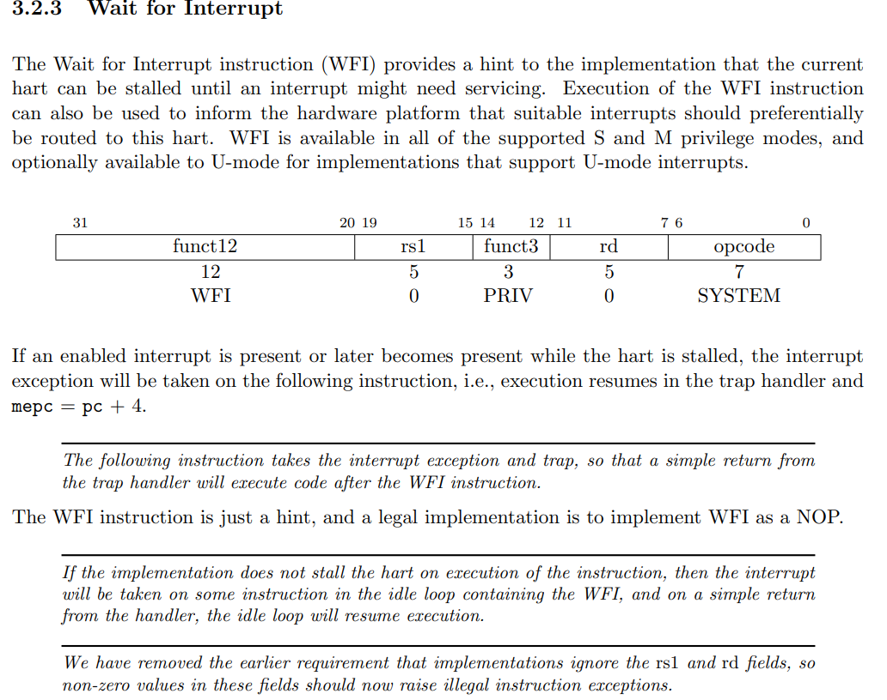

----
ESP Embassy HAL internals
===
#  GPIO
An interrupt handler with static list of wakers for each GPIO pin (AtomicWakers)
```bash +exec
bash goto.sh async-impl-v1m esp-hal/esp-hal/src/gpio/interrupt.rs 178
```

-----
ESP Embassy HAL internals: Summary
===
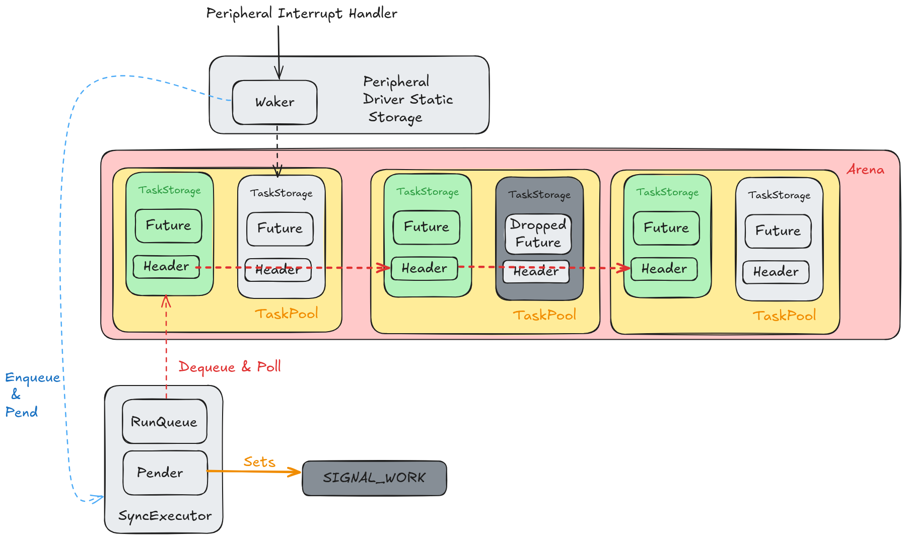

----

# References

Content is sourced from a lot of **very good** resources:

- [Embedded Rust Book](https://docs.rust-embedded.org/book/intro/no-std.html)
- Rusty Bits Youtube
- [Expressif Rust Book](https://docs.espressif.com/projects/rust/book/)

----
Archive Slides
----

Slides from last half of presentation in July 2025

----
Inspiration
===

<!-- column_layout: [1, 1] -->
<!--column: 0 -->

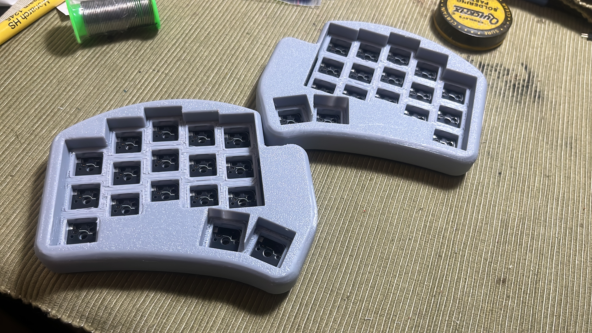


<!--column: 1 -->


----
Keyboard Electronics Refresher
----

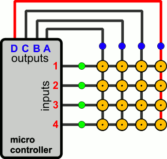

----
Keyboard Electronics Refresher
----

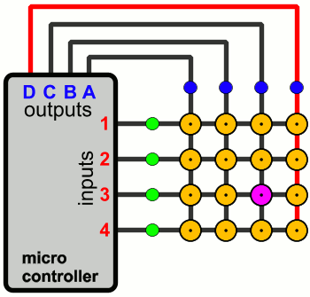

-----
Embedded Systems: The Limbs
===

Peripheral access through configuring registers

We will use:

- General Purpose IO: 1 Input and 2 Outputs
- A System Timer (systimer): Read time off the timer

<!-- pause -->
Configuration Registers are memory mapped

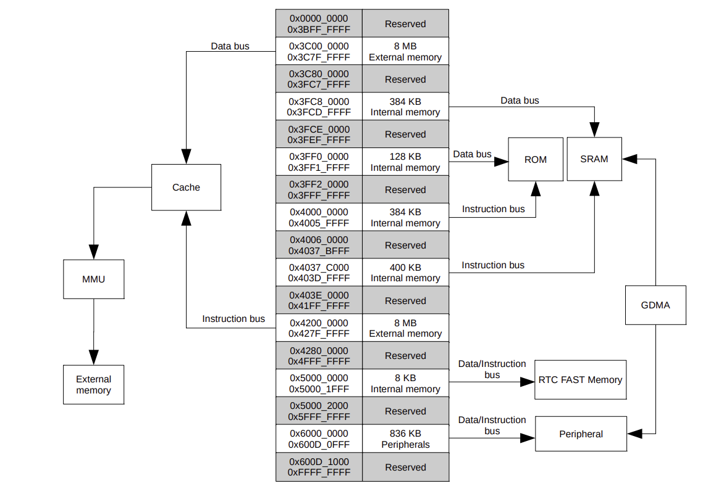

-----
Embedded Systems and Rust
===
# `no_std`
## entry point?
```
#[no_main]
```

ROM bootloader @ reset vector ->  second stage bootloader -> application entry_point

- ROM Bootloader: setups up architecture specific registers, bootloader mode (serial)
- Second stage bootloader: Loads application, sets up memory
```bash +exec
bash goto.sh sync-template-starter synckb/src/bin/main.rs 22
```

-----
Embedded Systems and Rust
===
# `no_std`
## high high hopes: panic handler

- std has unwind, and abort panic handlers

- panic halt
- panic semihosting (arm)
- define your own

```bash +exec
bash goto.sh sync-template-starter synckb/src/bin/main.rs 12

```


---
Embedded Systems and Rust
===
# `no_std`
## allocator?

- no allocator
- specify allocator with `global_allocator` (`alloc::core`)

```bash +exec
./goto.sh sync-template-starter synckb/src/bin/main.rs 30
```

-----

Embedded Systems and Rust
===
# Developer Ecosystem

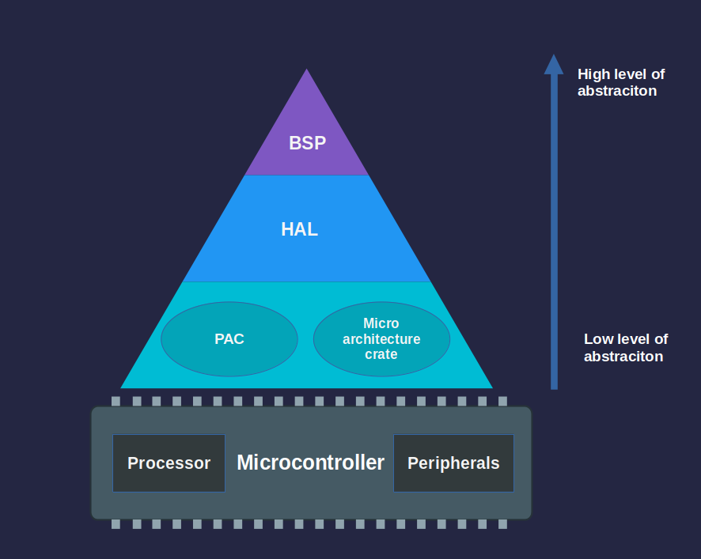

- Micro architectures: AVR, PIC, ARM Cortex,  RISC V
- SoC "series": Atmel (Atmega), STM, TI (MSP), Nordic (nRF), Expressif (esp32)
- Boards & Board Support Package Config tools: SDK configs, Yocto, Buildroot, Zephyr devicetrees

-----
Embedded Systems and Rust
===
# PAC & HAL
- PAC: register access, singleton to manage "safe" access
- HAL:
	- Implement shared traits for reuse: `embedded-hal`, `embedded_io`
	- Think device drivers
	-  init(): cpu clock, watchdog, peripheral, clocks for other peripherals
	
```bash +exec
bash goto.sh sync-template-starter synckb/src/bin/main.rs 28
```

<!-- pause -->
# basic implementation
```bash +exec
bash goto.sh sync-superloop synckb/src/bin/main.rs 28
```

-----
Embedded Systems and Rust
===

What we did was called the superloop pattern 

Let's leverage hardware to make things more power efficient
# It's a trap! Exceptions & Interrupts

> We use the term _exception_ to refer to an unusual condition occurring at run time associated with an instruction in the current RISC-V hart. We use the term _interrupt_ to refer to an external asynchronous event that may cause a RISC-V hart to experience an unexpected transfer of control. We use the term _trap_ to refer to the transfer of control to a trap handler caused by either an exception or an interrupt.

## Interrupts

<!-- column_layout: [3, 2] -->
<!--column: 0 -->
Vector Table: 31 interrupts, 15 levels of priority, level/edge triggered

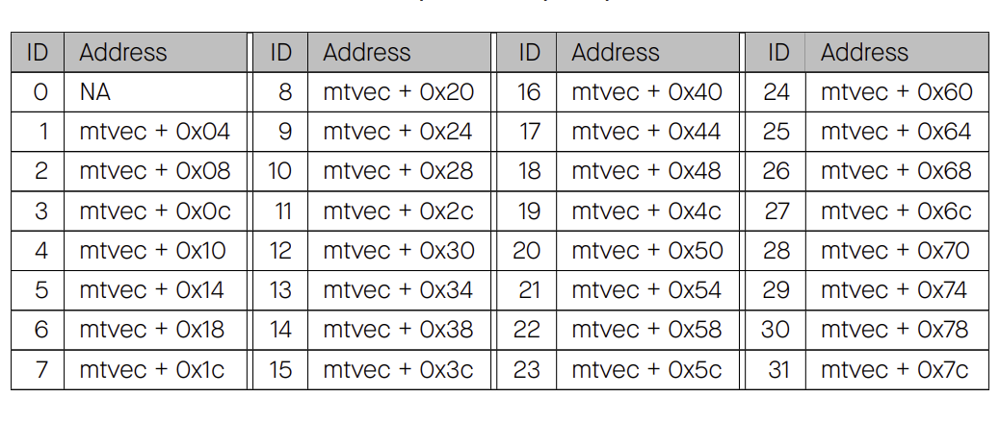
<!--column: 1 -->
ESP32C3 Interrupt Matrix

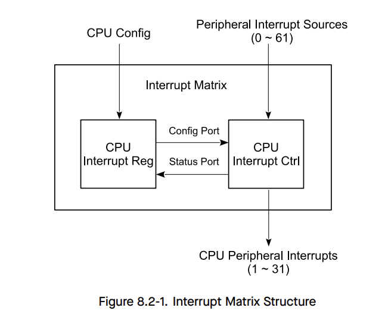

-----

Embedded  Systems and Rust
===
# `critical_section`
Usage:
```rust
static V: Mutex<Cell<u32>> = Mutex::new(Cell::new(0));

critical_section::with(|cs| { V.borrow(cs).set(42); });
```

HAL Implementation:
```rust
struct MyCriticalSection;
critical_section::set_impl!(MyCriticalSection);

impl unsafe critical_section::Impl for MyCriticalSection {
    unsafe fn acquire() -> RawRestoreState { ... }
    unsafe fn release(restore_state: RawRestoreState) { ... }
}

----
extern "Rust" {
	fn __acquire() -> RawRestoreState;
	fn __release(restore_state: RawRestoreState);
}
```

-----
Embedded  Systems and Rust
===
# `heapless`

Fixed capacity types, for static (or stack/heap if needed)
## MPMC lockfree queue

``` rust
pub struct MpMcQueue<T, const N: usize> { /* private fields */ }

impl<T, const N: usize> MpMcQueue<T, N> {
	pub const fn new() -> Self
	pub fn dequeue(&self) -> Option<T>
	pub fn enqueue(&self, item: T) -> Result<(), T>
}
```

-----
Embedded  Systems and Rust
===

```bash +exec
bash goto.sh superloopish-int synckb/src/bin/main.rs 103
```

```rust
enum Event {
    KeyPress,
    KeyRelease,
}

struct TimerInterruptCtx<'a> {
    outputs: [Output<'a>; 2],
    timer: PeriodicTimer<'a, esp_hal::Blocking>,
    current_output_idx: usize,
}

static INPUT: Mutex<RefCell<Option<Input>>>;
static QUEUE:MpMcQueue<Event, 4>;

// Context needed for timer interrupt
static TIMER_INT_CTX: Mutex<RefCell<Option<TimerInterruptCtx>>>;

```

-----
Embedded Systems and Rust
===

How is this more power efficient?

<!-- pause -->
# RISC V WFI instruction


```bash +exec
bash goto.sh superloopish-int-wfi synckb/src/bin/main.rs 103
```

